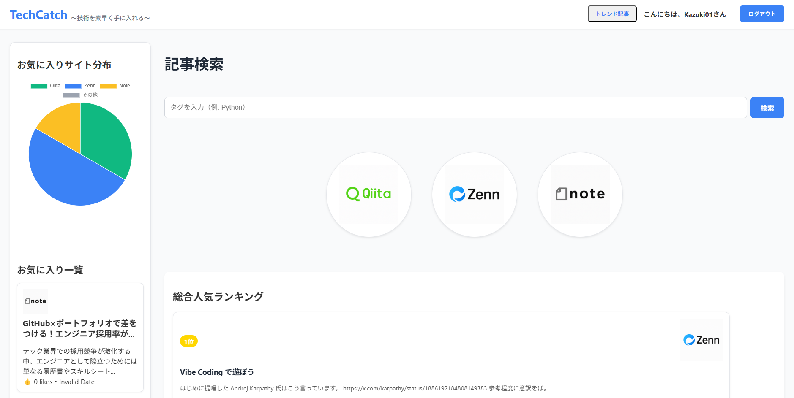
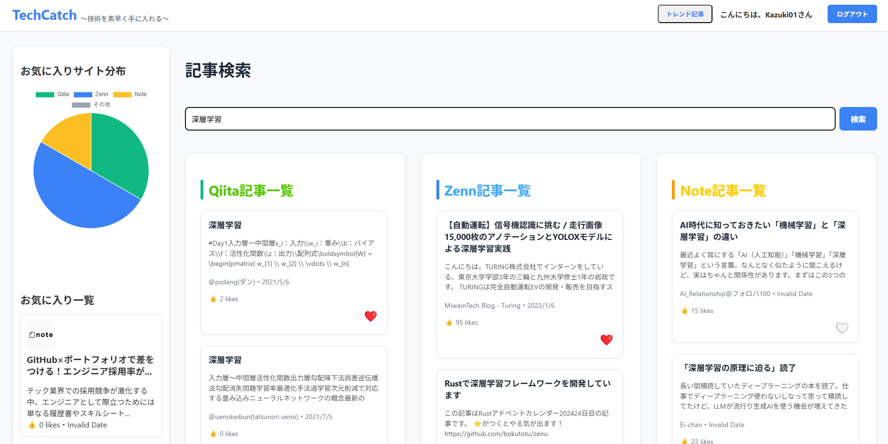
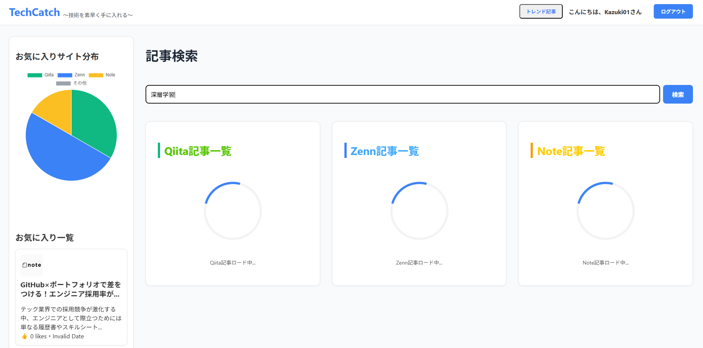
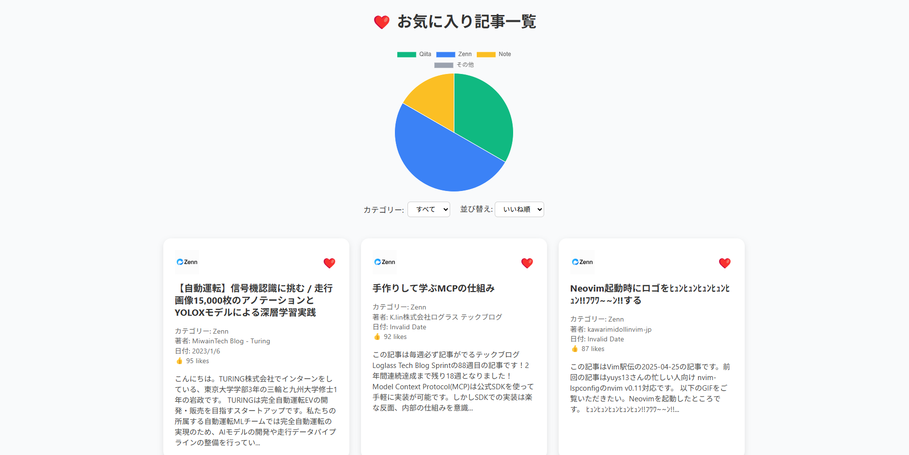
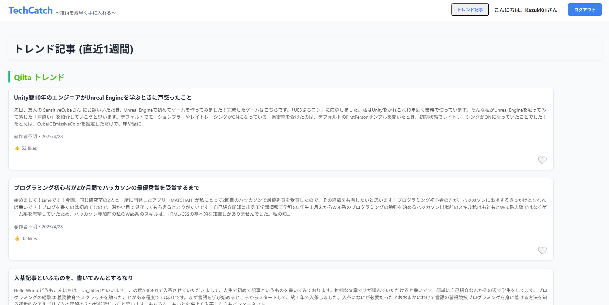

# TechCatch Application

**TechCatch Application** は、エンジニア向けの技術情報を素早くキャッチアップできることを目的としたWebアプリケーションです。主にQiita, Zenn, Noteから情報を取得することができ、それぞれの記事のトレンドになっている記事を取得して管理できます。

---

## アプリケーションを構成するページ一覧

### 1. メインページ

ここがアプリのメイン画面になります。

---

### 2. 検索ページ

記事検索で調べたい内容を入れると、Qiita, Zenn, Noteから情報を取得し各記事の検索結果を表示するようになっています。

---

### 3. ロ－ディング中のページ

記事を検索している際などには、待ち時間のストレスを無くすために、処理が実行されていることを明示的に可視化することで、ユーザー体験の向上を目指しています。

---

### 4.　お気に入りページ

お気に入り登録した記事を閲覧できる設計にしています。

---

### 5. トレンドページ

各サイトで1週間以内にトレンドになっている記事を取得し表示する設計になっています。

---

## フロントエンド構成

- `frontend/src/` - Reactコンポーネント群、本体ロジック 
- `frontend/src/components` - UIコンポーネント
- `frontend/utils/` - src/componentsの中で共通する関数群
- `frontend/package.json` - フロントエンドの依存関係とスクリプト定義
- `frontend/src/App.jsx` - ルーティングと全体レイアウトを管理するメインコンポーネント

---

## バックエンド構成

- `backend/settings.py` - Djangoプロジェクト設定ファイル
- `backend/urls.py` - ルーティング設定ファイル

---

## Djangoアプリの本体
- `tech_catch/scraper/` - 複数サイトからデータを取得するモジュール群
- `tech_catch/views.py` - APIエンドポイント処理
- `tech_catch/urls.py` - ルーティング設定ファイル
- `tech_catch/models.py` - データベースモデル定義

---

## Point

ユーザーが「おすすめ記事」をリクエストした際、待ち時間を極力減らすため、スクレイピング処理をバックエンドで並列実行する設計にしました。これにより、複数サイトからデータを集める場合でもレスポンスが遅くならず、ユーザーにとってストレスのない動作を実現しています。万が一、特定サイトの取得に失敗しても、他サイトのデータ取得に影響を与えない設計とし、ユーザーに対してできるだけ多くの情報を提供できるようにしています。

---

## Caution

現在はローカル環境での開発と動作確認を重点的に進めており、今後は細部まで検証を行った上で、デプロイを予定しています。

---

## Author
 
 
* 作成者：岡橋　和希
* 所属：九州工業大学院　情報工学府　情報創成工学専攻
* E-mail：kakazuki_yakyu@icloud.com